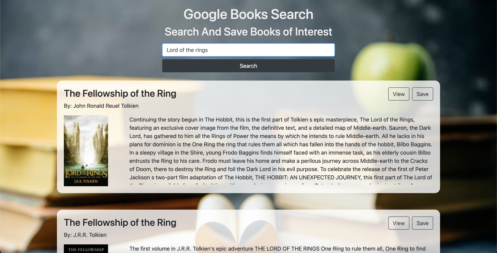

# React Google Books Search


## Description 
This application allows the user to sign in using google.  They can then proceed to search for books using the [Google Books Api](https://developers.google.com/books).  The app allows users to save books they like for later.  These books are stored in a database (mongoDB) and can later be viewed or deleted.  This application is built with a React.js Frontend and a Node.js backend on top of a MongoDB Database.          

#### Built With
* React.js
* Node.js
* MongoDB
* Boostrap
* [Google Books Api](https://developers.google.com/books). 

## Table of Contents
  
* [Installation](#installation)
* [Usage](#usage)
* [Questions](#questions)
  
  
## Installation
### View the Project Live <br>
https://react-google-books-app-1.herokuapp.com/


### Run the Project Locally

* Step 1: Navigate to the directory you want to store the project. Clone this your repository to your local computer using the command below. 
```bash
git clone https://github.com/Mark-Mulligan/google-book-search.git
```

* Step 2: Use the command line to navigate to the directory that you cloned the project.
Example:
```bash
cd directory/projectdirectory
```

* Step 3: Install the npm package dependencies from the package.json file.
```bash
npm install
```

* Step 4: Set up google oauth2.  You will need to follow the instructions below and update the environment variables both in the client. <br> 
https://developers.google.com/identity/protocols/oauth2/web-server

* Step 5: Update the environment variables in the config folder in db.js to allow you to access your local instance of mongoDB. <br>
https://docs.mongodb.com/manual/administration/install-community/

* Step 6: While in the project directory, run the program using node using the command below. Open you browser and navigate to localhost:3000 to view the application (Make sure your mongoDB instance is running and you have set up google o auth).
```bash
npm start
```  

## Usage 

#### Search Page

* This is where you can search for a specific book.  Once you search, each result will display general information about the book and allow you to view the specific google link to that book or save it to your collection.  



#### Saved Books Page

* This page shows you all the books you have currently saved.  Here you can view the links to the books on google or delete books you no longer want to be in your collection.  


## Questions
[My Github](https://github.com/Mark-Mulligan) || mark.mulligan.jr1@gmail.com

#### How to Contact Me
Feel free to reach out to me if you have any questions about this project.  You can email me using the email listed above or can go to my github page to view my other projects and portfolio.

© Mark Mulligan 2021 All Rights Reserved.